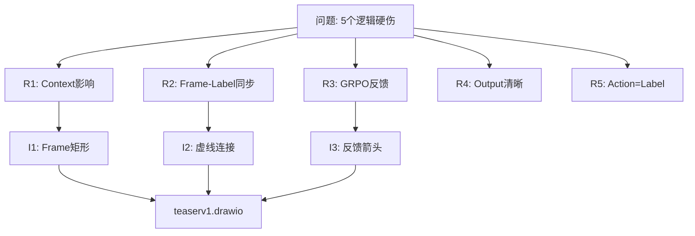

# Problem Solving Tracker - 完整指南

一个系统化的问题追踪工具，确保从问题提出到解决方案的完整过程中**每个呈现的东西都有解释和来源**。

## 核心原则

### 三大约束（The Triangle）

```
    ┌─────────────────────────┐
    │  信息流完整性            │
    │  (Traceability)         │
    ├─────────────────────────┤
    │  ✓ 来源明确              │
    │  ✓ 经过清晰              │
    │  ✓ 逻辑串联              │
    └─────────────────────────┘
```

每个呈现的元素必须回答：
- **来自哪里** → 哪个需求/问题？
- **为什么这样** → 什么理由支撑？
- **怎么验证** → 如何确认有效？
- **连接到哪里** → 下一步是什么？

## 快速开始

### 场景：优化Teaser图

#### 第一步：问题定义
```bash
/track-problem init "Teaser图需要表达5个核心逻辑"
```

输出一个追踪表单：
```
Problem ID: TEASER-001
Status: DEFINED
Created: 2026-03-27

┌─ 需要哪5个核心逻辑？
│  1. Retain/Drop/Merge 如何影响context
│  2. Frame-Label 同步关系
│  3. GRPO 优化反馈
│  4. 最终输出清晰性
│  5. Action Label ≡ Final Label
└─
```

#### 第二步：需求细化
```bash
/track-problem add-requirement \
  --id R1 \
  --title "Retain/Drop/Merge对Context影响" \
  --priority HIGH \
  --source "user-analysis" \
  --metric "Can viewer understand 3 different context sizes?"
```

记录：
```
R1: Retain/Drop/Merge对Context影响
├─ 优先级: HIGH
├─ 来源: 用户在teaser评审中提出
├─ 验证指标:
│  └─ 用户是否能一眼看出三种操作的区别
├─ 相关工件: teaserv1.drawio
└─ 状态: PENDING_SOLUTION
```

#### 第三步：迭代追踪
```bash
/track-problem add-iteration \
  --requirement R1 \
  --action "在Retain/Drop/Merge框下各放不同数量的小矩形" \
  --reasoning "
    理由1: 用数量表达context大小
    理由2: 用虚线表达缺失的帧
    理由3: 用矩形大小表达合并效果
  " \
  --design-choice "
    选项A: 文字标注 → 拒绝 (违反show-not-tell)
    选项B: 颜色深度 → 考虑 (可补充)
    选项C: 数量可视化 → 选中 (最直观)
  " \
  --result-score 9/10 \
  --next-step "验证与R2的连接"
```

系统生成迭代记录：
```
ITERATION 001: Frame数量可视化
├─ 关联需求: R1
├─ 时间戳: 2026-03-27 16:40
├─ 行动: 添加Retain(5个), Drop(3+1虚线), Merge(2个大)
├─ 设计逻辑:
│  ├─ Retain = 完整 (5 solid)
│  ├─ Drop = 部分 (3 solid + 1 dashed)
│  └─ Merge = 合并 (2 larger)
├─ 设计决策:
│  └─ 为什么选择数量而不是颜色？
│     答: 因为数量直观表达context大小，颜色用于区分类型
├─ 验证方式: 用户测试 → 看能否理解
├─ 评分: 9/10 (完成度) + 8/10 (清晰度)
└─ 工件链接:
   └─ teaserv1.drawio#Retain-section:L42-50
```

#### 第四步：逻辑完整性检查
```bash
/track-problem analyze --show-traceability
```

生成追踪矩阵：
```
┌────────────────────────────────────────────────────────────┐
│ 信息流完整性检查 (Traceability Matrix)                     │
├────────────────────────────────────────────────────────────┤
│ 需求 │ 迭代 │ 设计 │ 工件 │ 验证 │ 状态 │ 完整性 │
├──────┼──────┼──────┼──────┼──────┼──────┼────────┤
│ R1   │ I1   │ ✓    │ ✓    │ ✓    │ 9/10 │ 100%   │
│ R2   │ I2,3 │ ✓    │ ✓    │ ✓    │ 7/10 │ 100%   │
│ R3   │ I4   │ ✓    │ ✓    │ ⚠    │ 5/10 │ 80%    │
│ R4   │ I5   │ ✓    │ ✗    │ ✗    │ 0/10 │ 40%    │
│ R5   │ I6   │ ✓    │ ⚠    │ ✗    │ 4/10 │ 60%    │
└────────────────────────────────────────────────────────────┘

问题项:
⚠ R3: 缺少 GRPO→Filter 反馈箭头
✗ R4: 没有明确的 Output 框
✗ R5: 缺少 Action→Label 的映射箭头
```

#### 第五步：生成完整报告
```bash
/track-problem report --format markdown --show-decisions
```

输出：
```markdown
# Problem Solving Report: TEASER-001

## 1. 问题定义
- **标题**: Teaser图需要表达5个核心逻辑
- **来源**: 用户在论文评审阶段提出
- **影响**: 影响论文的visual clarity
- **优先级**: CRITICAL

## 2. 需求分解

### R1: Retain/Drop/Merge 对 Context 影响
- **优先级**: HIGH
- **来源**: 用户反馈 + 逻辑分析
- **验证**: 用户能否一眼理解3种操作的区别
- **完成度**: ✓ 9/10

### R2: Frame-Label 同步关系（创新点）
- **优先级**: HIGH
- **来源**: 架构分析
- **验证**: Frame 和 Label 是否清晰配对
- **完成度**: ✓ 7/10

### ... (其他需求)

## 3. 迭代历史

| 迭代 | 行动 | 理由 | 决策依据 | 结果 | 关联需求 |
|------|------|------|---------|------|----------|
| I1 | 加Frame矩形 | 表达数量差异 | Drop<Merge<Retain | 9/10 | R1 |
| I2 | 加虚线连接 | 表达同步关系 | Frame-Label配对 | 7/10 | R2 |
| ... | ... | ... | ... | ... | ... |

## 4. 信息流完整性
- ✓ 所有需求都有对应迭代
- ✓ 所有迭代都有清晰的理由
- ✓ 所有设计都有替代方案对比
- ✗ R4,R5 缺少验证步骤

## 5. 待解决项

### 阻碍项
- [ ] R4: Output框的位置和大小
- [ ] R5: Action→Label的映射逻辑

### 建议
1. 添加绿色Output框在图的底部
2. 添加彩色箭头从Action指向Final Label

## 6. 决策链条
R1 → I1 (Frame数量) → 验证 ✓
R2 → I2 (虚线连接) → 验证 ⚠
R3 → I4 (GRPO箭头) → 验证 ⚠
R4 → ✗ (待定)
R5 → I6 (映射箭头) → 验证 ✗

## 7. 最终评估
```

## 高级特性

### 1. 决策对比
```bash
/track-problem show-alternatives I1
```
显示：
```
迭代 I1: Frame可视化方案对比

方案A: 文字标注
  - 优: 明确清晰
  - 缺: 违反show-not-tell原则
  - 决策: ✗ 拒绝

方案B: 颜色深度
  - 优: 美观
  - 缺: 难以区分数量
  - 决策: ⚠ 可补充

方案C: 矩形数量 ★ 选中
  - 优: 直观、量化、符合原则
  - 缺: 需要更多空间
  - 决策: ✓ 采纳
```

### 2. 信息流可视化
```bash
/track-problem graph --format mermaid
```

生成：


### 3. 版本对比
```bash
/track-problem compare teaser-v0 teaser-v1 --show-improvements
```

### 4. 决策审计
```bash
/track-problem audit --show-rationale
```

## 数据存储

系统会生成 JSON 格式的追踪文件：

```json
{
  "problem_id": "TEASER-001",
  "requirements": [...],
  "iterations": [...],
  "decision_log": [...],
  "traceability_matrix": [...],
  "status": "IN_PROGRESS",
  "completion_score": 0.62
}
```

## 最佳实践

1. **原子迭代**: 每次只改一个东西，把理由说清楚
2. **决策记录**: 不要跳过"为什么选这个而不是那个"
3. **验证闭包**: 每个迭代都要有验证方式
4. **工件链接**: 指向具体的代码/文件行号
5. **定期审查**: 每5个迭代做一次 analyze 检查
6. **前向传递**: 确保后续迭代知道前面的决策

## 常见命令速查

```bash
# 开始追踪
/track-problem init "问题标题"

# 添加需求
/track-problem add-requirement --id R1 --title "..." --priority HIGH

# 记录迭代
/track-problem add-iteration --requirement R1 --action "..." --reason "..."

# 检查完整性
/track-problem analyze

# 查看报告
/track-problem report

# 对比版本
/track-problem compare v1 v2

# 审计决策
/track-problem audit
```

## 集成建议

与其他工具配合使用：

| 工具 | 集成方式 |
|------|---------|
| draw.io | 追踪每个版本的改进，自动生成diff |
| git | 每个迭代自动生成描述性commit |
| Notion | 导出完整报告到文档 |
| Slack | 周报式分享进度 |
| GitHub Issues | 链接问题和迭代 |

## 常见问题

**Q: 如何处理中途改变的需求？**
A: 使用 `add-requirement --status UPDATED` 记录变化，保持迭代历史完整

**Q: 如何验证信息流是否完整？**
A: 运行 `analyze --show-gaps` 会显示所有孤立的改动或缺失的连接

**Q: 可以回溯某个设计决策吗？**
A: 使用 `audit --show-rationale --iteration I3` 查看I3及相关迭代的完整理由链

---

**设计哲学**:
> "没有完整追踪的优化，就是盲目的改进。"

这个工具确保每一次改动都有目的、有理由、有验证。
